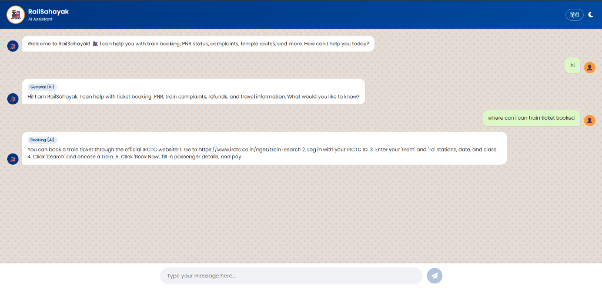

# RailSahayak - Indian Railways AI Assistant 🚂

RailSahayak is an AI-powered assistant for Indian Railways, leveraging Gemini 2.0 Flash and a ChromaDB Retrieval-Augmented Generation (RAG) backend. It can help users with ticket booking, PNR status, complaints, tatkal tips, and more, in both English and Hindi.



## Features
- **Bilingual Support**: Chat in English or Hindi.
- **RAG Architecture**: Uses ChromaDB to fetch contextually relevant railway information.
- **Powered by Gemini**: Uses Google's Gemini 2.0 Flash for generating accurate and helpful responses.
- **Quick Actions**: One-click chips for common queries.

## Project Structure
- `backend/`: Node.js server with Express, ChromaDB, and Gemini API integration.
- `frontend/`: (Optional) Vite React frontend implementation.
- `index.html`, `app.js`, `style.css`: The main vanilla HTML/JS static frontend interface.

## Installation & Setup

### Prerequisites
- Node.js (v18+)
- Python (for ChromaDB)
- [Gemini API Key](https://aistudio.google.com/)

### 1. Start ChromaDB
You need ChromaDB running locally. Open a terminal and run:
```bash
# Install chromadb if you haven't already
pip install chromadb

# Run the ChromaDB server
chroma run --path ./chroma_data
```

### 2. Setup the Backend
Open a new terminal window:
```bash
cd backend
npm install
```

Create a `.env` file inside the `backend/` directory and add your Gemini API key (there is an `.env.example` file for reference):
```env
GEMINI_API_KEY=your_api_key_here
```

### 3. Ingest Data
Before running the app, populate the ChromaDB with the railway knowledge base:
```bash
cd backend
npm run ingest
```

### 4. Start the Backend Server
```bash
cd backend
npm run dev
```

### 5. Start the Frontend
You can simply open `index.html` in your browser, or serve it using a local server from the root directory:
```bash
npx http-server . -p 8080
```
Then navigate to `http://localhost:8080` in your browser.

## Usage
- Open the application.
- Click on the gear icon (Settings) to input your Gemini API Key directly in the frontend if needed.
- Start asking questions like "How to book a ticket?" or "Tatkal booking rules".
